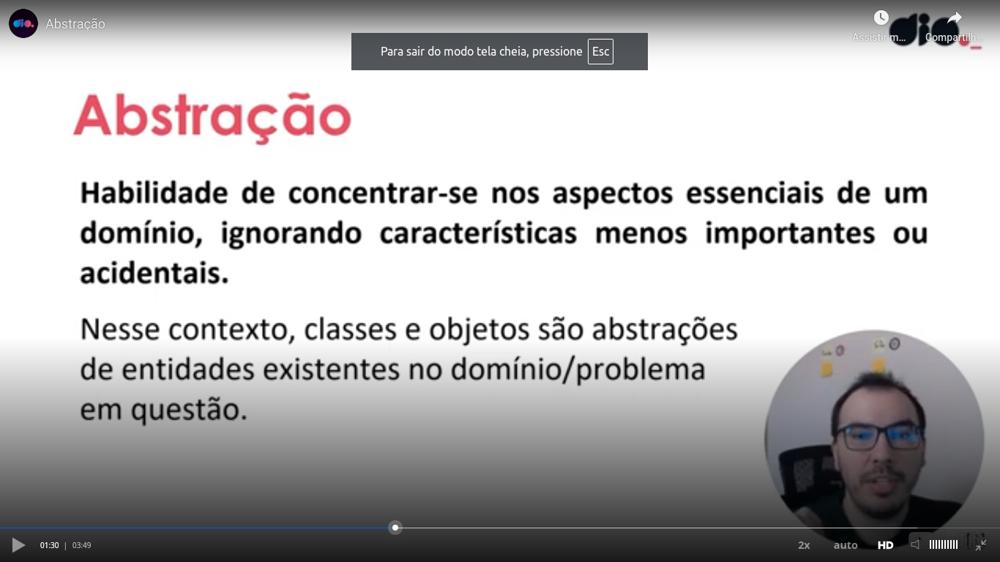
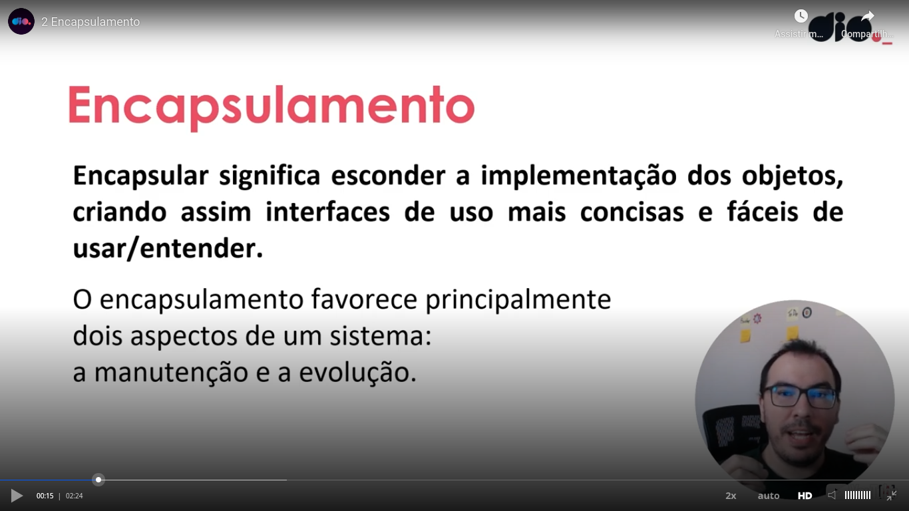
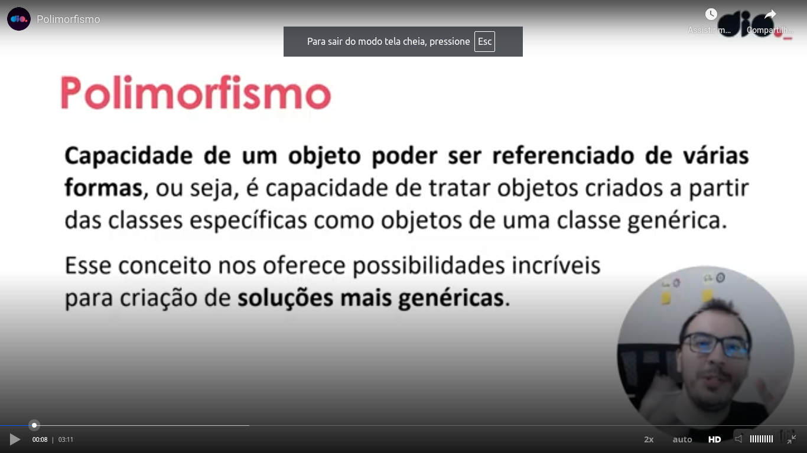

# Abstraction




# Encapsulation




# Inheritance


## Tests related to a simple inheritance

Please see the comments in the next code:

```kotlin
package tests

open class Dog { // open keyword - means that this class can be extended
    open fun sayHello() { // open - means that this function can be overridden
        print("wow wow")
    }
}

class Yorkshire: Dog() { // : Dog() - inheritance in Kotlin - parenthesis must be used
    override fun sayHello() { // override keyword - overriding a function
        print("wif wif")
    }

    fun jump() {
        print("Yorkshire jumped!")
    }
}

fun main() {
    val dog:Dog = Yorkshire()
    dog.sayHello()
    print(" -- ")
    
    // error - jump is not a function of Dog class
    // As we setted the type Dog of the variable, it will do the things as a Yorkshire, 
    // sayHello() function as example, overriden function, NOT JUMP,
    // but have the type 'Dog'
    // dog.jump() 

    val yorkshire = Yorkshire()
    yorkshire.sayHello()
    print(" -- ")

    // Yorkshire can jump
    yorkshire.jump()
}
```

## Inheritance with a parametrized constructor

Please see this code:

```kotlin
package tests

open class Tiger(var origin: String) {
    fun sayHello() {
        print("Hello to tiger from $origin")
    }
}

class SiberianTiger: Tiger("Siberia")

// class BengalTiger: Tiger() // You must specify the origin

fun main() {
    val siberianTiger1 = SiberianTiger()
    siberianTiger1.sayHello()

    print(" -- ")

    // You cannot override the origin this way in the constructor
    // val siberianTiger2 = SiberianTiger("Russia")
    // siberianTiger2.sayHello()

    siberianTiger1.origin = "Russia"
    siberianTiger1.sayHello()

    // val bengalTiger = BengalTiger("Bengal")
    // bengalTiger.sayHello()
}
```

Other possibility is to pass an argument to the constructor of the parent class:

```kotlin
package tests

open class Lion(val name: String, val origin: String) {
    fun sayHello() {
        print("$name, the lion from $origin")
    }
}

class Asiatic(name: String): Lion(name = name, origin = "India")

fun main() {
    val lion:Lion = Asiatic("Rufo")
    lion.sayHello()
}
```

As you can see, the `Asiatic`, it does not have receives 2 parameters in the constructor. name does not have an identifier var or val and it does not receives origin. It pass to constructor of the parent class a fixed value "India"


# Polymorphism




# Data Classes

Automatically implements some methods, as example:
- `equals()`
- `hashCode()`
- `toString()`

Please see the following example:

```kotlin
package tests

data class User(val id: Int, val name: String) {
    override fun equals(other: Any?): Boolean {
        return other is User && other.id == this.id
    }
}

fun main() {
    val user1 = User(1, "Alex")
    val user2 = User(1, "Alex")
    val user3 = User(3, "Max")

    print("user1 === user2 ${user1 === user2}")
    
    // Hashcode of user1 and user2 is the same because all properties of them
    // have the same value
    print(" -2- ")
    print(user1.hashCode())
    print(" -3- ")
    print(user2.hashCode())
    print(" -4- ")
    print(user3.hashCode())

    // Copy
    // ==  true -  id equals - same as we made a copy
    // === false - different address in memory
    print(" -5- ")
    print(user1 == user1.copy())
    print(" -6- ")
    print(user1 === user1.copy())

    // when you copy you can change properties values
    print(" -7- ")
    print(user1.copy(7))
    print(" -8- ")
    print(user1.copy(name = "Marcelinho"))
}
```


# Enum classes

Please see the following example:

```kotlin
package tests

enum class Color(val rgb:Int) {
    RED(0xFF0000), // <= see the comma
    GREEN(0x00FF00), // <= see the comma
    BLUE(0x0000FF), // <= see the comma
    YELLOW(0xFFFF00); // <= See the semicolon

    fun containsRed() = (this.rgb and 0xFF0000 != 0)
}

fun main () {
    val red = Color.RED
    print(red.containsRed())
    print(" - 2 - ")
    print(Color.BLUE.containsRed())
    print(" - 3 - ")
    print(Color.YELLOW.containsRed())
}
```


# Sealed classes

Please see the followin example:


What is more important of sealed classes is that they only allow extensions in classes of the same package. In the example you can see aspects of object oriented programming, like polymorphism.


## Object expression

Please see [this code](https://pl.kotl.in/jnHJ7wsRH1) in Kotlin Playground:

```kotlin
package tests

fun main() {
    val obj = object { // see the keyword 'object'
        var name: String = "André" // no quotes
        var age: Int = 45
        var sons:Int = 1

        fun greet() { // Ou can create functions in the object
            println("Hi")
        }
    }
    println(obj.name)
    println(obj.age)
    obj.greet()
    print(obj)
}    

```

To the previous code works, obj must have the same function scope of the "printlns";


## Object declaration

This way you can create an object like a singleton this way:

```kotlin
package tests

object Unique {
    var idade:Int = 45
    val name = "André"

    fun sayHello() {
        print("Hello!")
    }
}

fun main() {
    Unique.sayHello()
    print(" -- ")
    print(Unique.name)
    print(" -- ")    
    print(Unique.idade)
}
```

Different of the previous thing that we studied (object expression), in this case the object must be in the global scope.